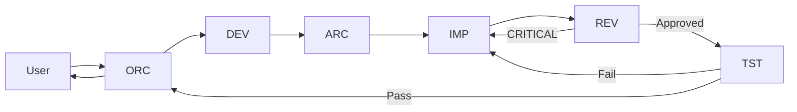
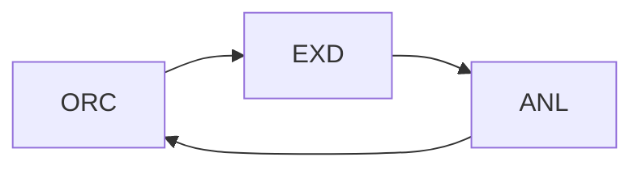
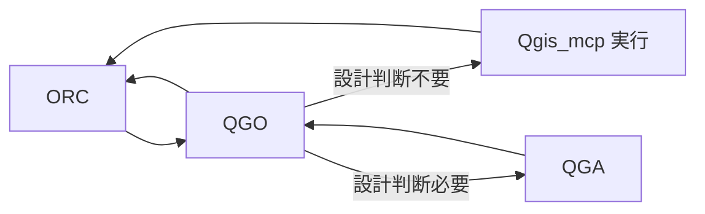
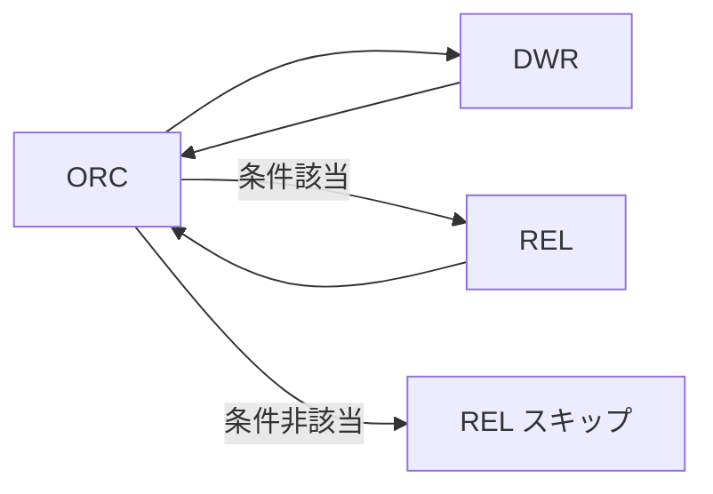
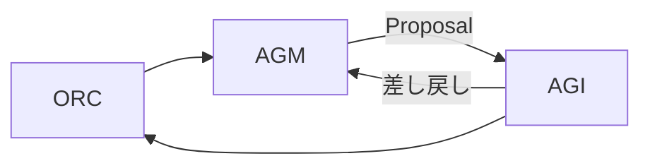

# ORC Operations Reference

## 1. エージェント生態系

| ID   | 名称                         | 役割                                                                     | 種別           | 所属         |
| ---- | ---------------------------- | ------------------------------------------------------------------------ | -------------- | ------------ |
| ORC  | Orchestrator                 | タスク受付・フロー設計・サブエージェント統制・完了判定                   | 司令塔         | foundation   |
| SRC  | Searcher                     | Web/論文/技術文書の検索・収集（汎用/研究系/技術系の3モード）             | 検索系         | surfing      |
| AGM  | Agent Manager (Architect)    | プロジェクト固有エージェント定義の設計・レビュー                         | 管理系         | foundation   |
| AGI  | Agent Manager (Implementer)  | プロジェクト固有エージェント定義の実装・配置                             | 管理系         | foundation   |
| DWR  | Document Writer              | ORC/他エージェントの成果物から設計書・仕様書・知識ベース文書を生成       | 文書生成系     | foundation   |
| CEX  | Code Explorer                | ローカルコードベースのディレクトリ構造分析・ファイル探索・全文読み取り   | 分析系         | foundation   |
| DEV  | DevPlanner                   | 要件分析・機能仕様決定・設計判断（何を作るか）                           | 実装系         | code         |
| ARC  | Architect                    | アーキテクチャ設計・技術スタック選定・IF仕様策定（どう作るか）           | 実装系         | code         |
| IMP  | Implementer                  | コード実装・デバッグ                                                     | 実装系         | code         |
| REV  | Reviewer                     | コードレビュー・セキュリティチェック・仕様準拠検証                       | 実装系         | code         |
| TST  | Tester                       | テスト実行・合否判定                                                     | 実装系         | code         |
| REL  | Release Manager              | git管理・バージョニング・タグ付け（独立セッションまたは同一セッション委譲） | 独立リリース系 | code         |
| EXD  | Experiment Designer          | 実験設計・評価指標定義・ベンチマーク設計                                 | 研究系         | research     |
| ANL  | Analyst                      | 調査/実験結果の分析・最適解導出                                          | 研究系         | research     |
| QGA  | QGIS Architect               | QGIS 操作の設計判断（手法選定・ワークフロー設計）                        | GIS 操作系     | qgis         |
| QGO  | QGIS Operator                | QGIS タスク一次受け・Qgis_mcp 経由の操作実行                             | GIS 操作系     | qgis         |

---

## 2. 情報フロー

### 実装系フロー（standard）

### 研究系フロー

### 検索系フロー

### GIS 操作系フロー

### 文書生成フロー

### Agent Customization フロー

---

## 3. チェーン委譲モード

### 発動条件

#### 実装系（全5条件を満たすこと）

1. タスクカテゴリが「実装」である
2. 要件が明確で、DEV の判断余地が小さい（新規設計より既存拡張が中心）
3. 既知の技術スタックを使用する
4. ORC の確信度が 85%（中）以上である
5. 研究要素を含まない純粋な実装タスクである

#### Agent Customization / Agent Team Design 系（全5条件を満たすこと）

1. 変更内容がエージェントカスタマイズに関するものである
2. 要件が明確で、AGM の判断余地が小さい
3. 既存ルールとの矛盾がない
4. ORC の確信度が 85%（中）以上である
5. 研究要素を含まない純粋な設計/実装タスクである

### 動作

- チェーン委譲モード発動時は、実装系は `DEV→ARC→IMP→REV→TST`、Agent Customization 系は `AGM→AGI` を一括指示する
- 各エージェントは `.github/instructions/handoff_protocol.instructions.md` に従って直接ハンドオフを行う
- ORC は初回ハンドオフに `Task Context` を注入し、チェーン内の全エージェントが継承・追記する

### CRITICAL 差し戻し時のエスカレーション

- CRITICAL 差し戻し（REV→IMP, TST→IMP, AGM→AGI の再修正）発生時のみ ORC にエスカレーションする
- 通常の差し戻しはチェーン内で解決する

### TST 完了後の REL 確認フロー

TST 完了後、ORC はユーザに `vscode/askQuestions` で確認する：

> 「実装が完了しました。REL に委譲してリリースしますか？（yes/no）」

- この確認は TST の結果（合格/不合格）にかかわらず、実装チェーン完了時に必ず行う
- ユーザが承認（yes）した場合 → ORC は同一セッション内で REL に委譲し git 管理を実行させる
- ユーザが拒否（no）した場合 → REL 委譲はスキップし、ORC はそのまま完了報告を行う

---

## 4. コマンド実行委譲

ORC がコマンド実行を必要とした場合、以下の優先順位で処理する：

1. **read 代替確認**: コマンドの結果がファイル出力される場合、`read` ツールで代替可能か確認する
2. **他ツール確認**: `search` / `web` / `open-websearch` など既存の保有ツールで代替可能か確認する
3. **サブエージェント委譲（目的別）**:
   - **IMP**: コード生成・ビルド・依存関係インストール・スクリプト実行
   - **REV**: 静的解析・lint・セキュリティスキャン
   - **TST**: テスト実行・テストスイート起動
4. **純粋なコマンド実行**: 上記いずれにも該当しない場合、最も目的に近いサブエージェントが直接実行する

---

## 5. 不足検知とエスカレーション

ORC はタスク遂行中に以下の不足を認識した場合、**AGM（Agent Manager (Architect)）に通知し、エージェント構成の見直しを依頼する**：

### 3類型

| 類型             | 説明                                                       | 対応                                   |
| ---------------- | ---------------------------------------------------------- | -------------------------------------- |
| エージェント不足 | タスク遂行に必要なエージェント種別がチームに存在しない     | AGM に通知し、新規エージェント設計を依頼 |
| 規約の不足       | 既存の指示書・規約でカバーされていない領域があり、支障が出る | AGM に通知し、規約追加を依頼           |
| フロー破綻       | ハンドオフフローが想定通り機能せず、構造的な問題がある     | AGM に通知し、フロー再設計を依頼       |

### 注意

- ORC はこれらの問題を自己判断で解決しようとせず、AGM に状況を伝えて構成管理を委ねる

---

## 6. 状態管理

- 詳細状態は内部メモリに保存し、チャットには進捗と主要決定のみを出す
- 共有が必要で保存すべき情報は local docs の `shared/` に保存する
- 進行度ステータスは以下の4状態を用いる：

| ステータス     | 意味                               |
| -------------- | ---------------------------------- |
| `not_started`  | 未着手                             |
| `in_progress`  | 実行中                             |
| `blocked`      | ユーザ確認待ち・外部リソース待ち   |
| `done`         | 完了                               |

---

## 7. 完了判定

ユーザの依頼がフローで完了し、未確定事項が残らず、失敗事項は原因と次アクションを提示した状態をもって完了とする。
